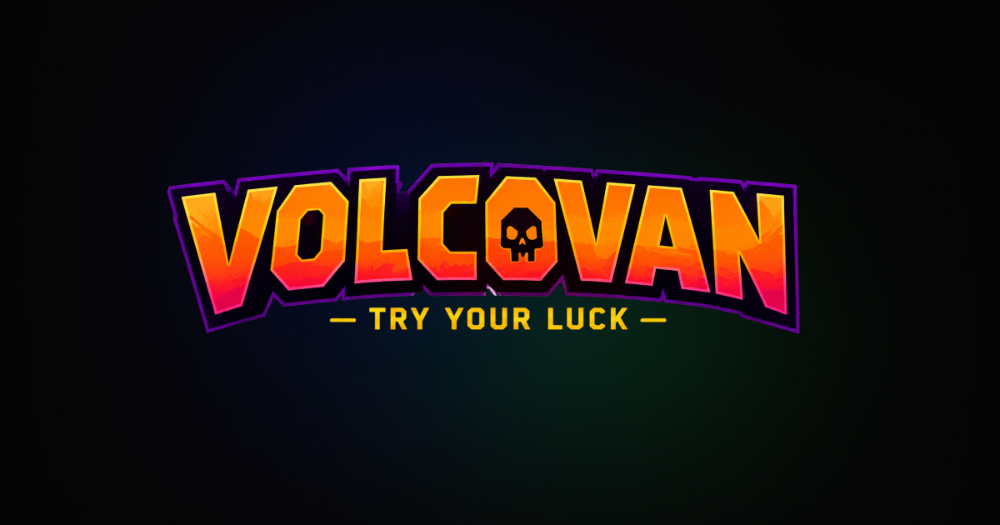

# 🌋 Magma Rush - Digital Game HUD


This is the digital companion application for the **Magma Rush** board game, built during the **Open Window Hackathon 2026**. 

Designed to act as a "Game Master" dashboard, this app strips the math, timers, and stat-tracking away from the physical board and handles it all on-screen. It features a "U-Shape" layout designed to frame the screen, leaving the center open for future background elements or 3D board integrations.

## ⚙️ Core Mechanics

* **Dynamic Player Roster:** A carousel-style queue system. As a turn ends, the array slices and rotates, keeping the active player at the top and pushing the rest into a "Coming Up" stack.
* **Live Stat Editing:** A 2x2 control grid allowing the Game Master to instantly increment or decrement the active player's Trophies, Coins, Flames, and Skulls.
* **Deterministic Event Engine:** Dice rolls are strictly bound to event cards. Rolling a "Bad 2" explicitly pulls the corresponding card and instruction set, removing frustrating double-RNG from the gameplay loop.
* **Persistent State:** Uses React Router's location state to pass setup data, and hooks into `localStorage` so the game doesn't wipe itself if you accidentally navigate to the rules or credits.
* **Custom Context Menus:** Native browser right-clicks are intercepted on player cards, allowing you to instantly "Kill" (remove from the array) or "Declare Win" (triggering the victory overlay and freezing the clock).

## 🛠️ Tech Stack
* **Frontend:** React.js
* **Routing:** React Router DOM (v6)
* **Styling:** Vanilla CSS (Flexbox, CSS Grid, Glassmorphism, CSS Keyframe Animations)
* **Deployment:** Vercel

## 🚀 How to Run Locally

1. Clone the repository:
```bash
   git clone [https://github.com/BVLTRA/Hackathon26.git](https://github.com/BVLTRA/Hackathon26.git)

```

2. Navigate to the frontend directory:
```bash
cd Hackathon26/frontend

```


3. Install dependencies:
```bash
npm install

```


4. Start the development server:
```bash
npm start

```


The app will launch at `http://localhost:3000`, bypassing authentication and dropping you straight onto the Landing Page.

## 👥 The Magma Rush Team

**Digital Engineering & UI/UX**

* Britney Leigh Cronje
* Ntsika Madlala
* Nicole Soldatos
* Shané Oberholzer
* Tshedza Mosehane


**Physical & Technical Design**

* Immre-Lee Rudman
* Nell Janse van Rensburg
* Nicole Lamarque
* Reece Livingston
